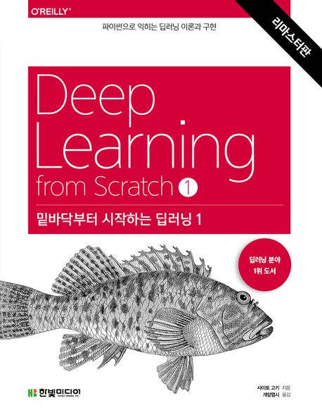

# Deeplearning_from_Scratch

## 목차

1. [소개](#소개)
2. [참여 멤버](#참여-멤버)
3. [책 정보](#책-정보)
4. [주제](#주제)
5. [실습](#실습)
6. [학습 자료](#학습-자료)
7. [기여 하기](#기여-하기)

## 소개

이 리포지토리는 "밑바닥부터 시작하는 딥러닝1"을 기반으로 하는 "통스패치" 딥러닝 스터디를 위한 자료 및 프로젝트를 관리하는 공간입니다. 여기에서는 교재 내용을 바탕으로 한 학습 자료, 코드, 그리고 스터디 프로젝트에 관한 정보를 찾을 수 있습니다.

## 스터디 소개

### 통스패치 멤버
- 정연우
- 정희진
- [나 (스터디 리더)](https://github.com/hwawon-workspace)

### 스터디 기간
2024.03. ~ 2024.12.

### 스터디 목적
통스패치는 통계학과 학생들의 딥러닝 스터디 모임입니다. 딥러닝 이론을 수식 차원에서부터 보다 깊게 이해하기 위해 해당 교재를 선정하였고, 주 1회 스터디를 진행하게 되었습니다.

## 책 정보

- **책 이름**: 밑바닥부터 시작하는 딥러닝1
- **저자**: 사이토 고키

## 주제

- 신경망 이론
- 프레임 워크 없이 딥러닝 구현
- CNN

## 실습

- [1장 실습](CH01/): 헬로 파이썬
- [2장 실습](CH02/): 퍼셉트론
- [3장 실습](CH03/): 신경망
- [4장 실습](CH04/): 신경망 학습
- [5장 실습](0CH05/): 오차역전파법
  
## 학습 자료

- [교재](https://www.yes24.com/product/goods/141787639): 밑바닥부터 시작하는 딥러닝1

## 기여하기

1. 이 리포지토리를 포크합니다.
2. 새 브랜치를 생성하고 작업합니다: `git checkout -b feature/new-feature`
3. 변경 사항을 커밋합니다: `git commit -am 'Add a new feature'`
4. 변경 사항을 원본 리포지토리에 푸시합니다: `git push origin feature/new-feature`
5. 풀 리퀘스트를 생성합니다.
